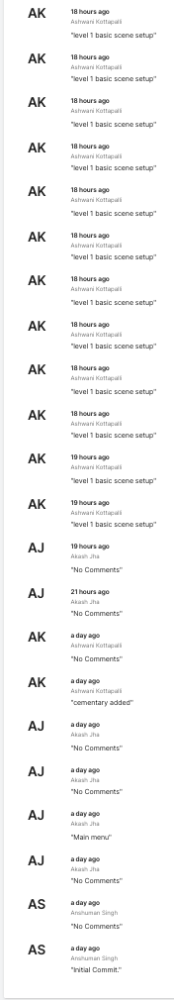
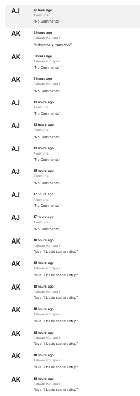

# Paranormal
<b>Paranormal</b> is an AR immersive game for the horror enthusiasts

## Tech used:
<ul>
  <li>UNITY 3D - A game development engine, CHIMERA is made on Unity 3D engine
  <li>AR Foundation- For AR
<li>Blender - To create 3D assets for some games
<li>C# - Programming Language used for making games on Unity 3D
</ul>

## Team Members
<ul>
  <li>Akash Jha</li>
  <li>Ashwani Kotapalli</li>
  <li>Anshuman Singh</li>
  <li>Abhijeet Swain</li>
</ul>

## Screenshots
- Unity Collab commit history(As of 5:30PM, 1st November) 
  
  
 
